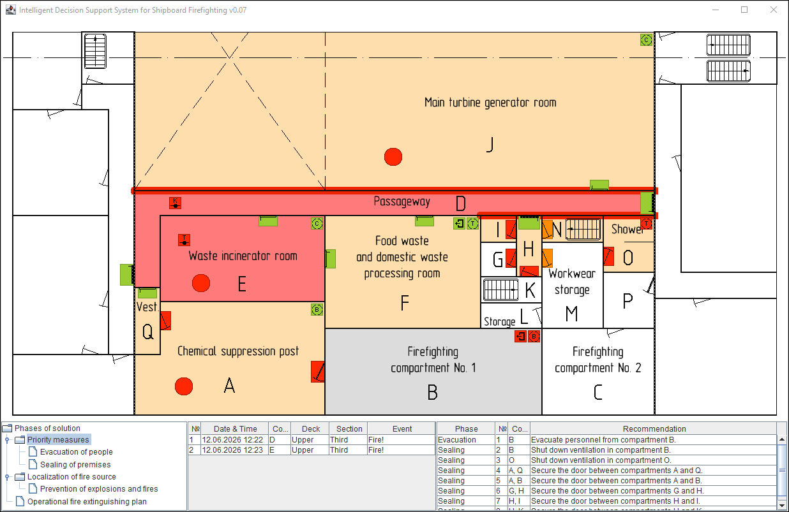

# Rule-Based Decision Support System for Shipboard Firefighting (2008-2026)

[](https://github.com/aleksey-lukyanets/firefighting-expert-system/actions/workflows/ci.yml)
[](https://sonarcloud.io/summary/new_code?id=aleksey-lukyanets_firefighting-expert-system)
[](https://sonarcloud.io/summary/new_code?id=aleksey-lukyanets_firefighting-expert-system)
[](https://sonarcloud.io/summary/new_code?id=aleksey-lukyanets_firefighting-expert-system)
[](https://sonarcloud.io/summary/new_code?id=aleksey-lukyanets_firefighting-expert-system)
[](https://sonarcloud.io/summary/new_code?id=aleksey-lukyanets_firefighting-expert-system)

A prototype of a rule-based decision support system developed in 2008 as a student project, and refactored in 2026. The system was designed to assist operators in managing complex emergency situations by collecting available data, analyzing the operational picture, and presenting structured recommendations.

### Informal note

> Feel free to think of this application as an interactive firefighting game aboard a large vessel. Step into the role of the ship's damage control officer, and take every measure to save the vessel and her crew — free of any real-world consequences or liability. Have fun.

### Quick start

Just double-click `run.bat`. On the first run the application will automatically download a portable Java 17 JRE (a ~39 MB download, ~110 MB unpacked). Subsequent launches will start immediately.

<br/>
<p align="center">
    
</p>
<br/>

## Table of Contents

- [Project Overview](#project-overview)
- [Background and Motivation](#background-and-motivation)
- [Core Functionality](#core-functionality)
- [CLIPS Rule Engine](#clips-rule-engine)
- [Modernization (2026)](#modernization-2026)
- [How to Run](#how-to-run)
- [Technical Stack](#technical-stack)
- [Project Structure](#project-structure)
- [Limitations](#limitations)
- [Refactoring Roadmap](#refactoring-roadmap)
- [License](#license)
- [Acknowledgments](#acknowledgments)

## Project Overview

This project is a historical example of a rule-based expert system typical of the late 2000s. It integrates the CLIPS rule engine (originally developed by NASA) with domain-specific logic to support structured decision-making under time pressure. The deck plan used as a reference in the prototype corresponds to one of the decks of the Russian nuclear icebreaker *Arktika*, project 22220.

In the course of working on this student project, the author conducted a thorough review of the contemporary literature on intelligent systems and emerging directions in artificial intelligence. Alongside classical expert systems, significant attention was given to fuzzy logic, neural networks, machine learning, and evolutionary algorithms. The author also carried out practical experiments in training neural networks. Looking back two decades later, it is evident that these directions proved to be highly promising. Intelligent systems have since made remarkable progress, fundamentally transforming many fields of technology and industry.

## Background and Motivation

The prototype was created in response to the specific challenges of firefighting on large vessels, both civilian and naval, including nuclear-powered ships.

Large vessels represent complex engineering structures with dense equipment layouts, extensive forced ventilation systems, and high concentrations of combustible materials. Firefighting on such platforms is inherently difficult, even when supported by automated suppression systems. In specific, fire propagation is aggravated by the high thermal conductivity of metal bulkheads and decks, which can transfer heat to adjacent compartments even when direct flame contact is absent, requiring continuous cooling of bulkheads and decks. As a result, effective firefighting requires a high level of situational awareness, real-time information processing, coordination, and timely decision-making from the crew.

This prototype was developed to explore how an expert system could improve operator performance by automatically aggregating available sensor data and operational information, performing rule-based analysis, and delivering concise, actionable recommendations in a clear and concise form.

## Core Functionality

#### Expert System Operation:

- Initialization and loading of the CLIPS rule base at application startup
- Automatic analysis of the operational situation using the expert system rules
- Generation of a recommended actions table based on CLIPS inference results
- Support for multiple decision-making phases: evacuation, compartment sealing (making spaces gas-tight), prevention of ignition/explosion, fire containment, and firefighting
- Collection and processing of CLIPS data for selection of available fire hydrants, water supply positions, and fire containment boundaries
- Logging of the expert system inference process and results

#### Operational Situation Display:

- Deck compartment layout with indication of manned spaces and crew workstations
- Location and status of fire detectors, combustible and flammable materials, fire hydrants, and ventilation systems
- Interactive marking of equipment status, doors, and ventilation systems

#### Fire Prevention Recommendations:

- Evacuation routes for crew from compartments cut off by fire
- Compartment sealing (making spaces gas-tight), ventilation shutdown, and de-energizing of ship systems in threatened spaces
- Warnings of potential hazards associated with combustible and flammable materials

#### Fire Containment and Suppression Recommendations:

- Analysis of potential fire spread paths
- Rational selection of fire containment boundaries taking into account accessibility and crew safety
- Selection and positioning of available fire hoses for cooling bulkheads (walls)
- Sequence of offensive actions against seats of fire considering the compartment layout

## CLIPS Rule Engine

[CLIPS](https://www.clipsrules.net) (C Language Integrated Production System) serves as the core forward-chaining, data-driven rule engine of the system. In CLIPS, execution is controlled entirely by data: facts asserted into working memory (from sensors, user input, or previous inferences) automatically trigger pattern matching and rule activations. There is no explicit main control loop or direct calls to rules by name — the inference engine reactively manages the entire process.

This forward-chaining design brings several key advantages that align well with the demands of a real-time firefighting decision-support system on large vessels:

- **Reactivity and dynamism** — New or updated facts (e.g., sensor readings on fire spread, temperature, smoke, or compartment status) immediately cause re-evaluation of applicable rules. This makes the system naturally suited to monitoring evolving emergency situations, running “what-if” analyses, and generating timely recommendations without polling or explicit triggers.
- **Comprehensive inference** — The engine derives all possible conclusions from the current set of facts as long as rule activations exist. It does not stop at the first matching goal (as in goal-driven backward chaining) but continues propagating inferences, ensuring a rich operational picture and multiple layers of recommendations (evacuation, containment, suppression, etc.).
- **Declarative control through conflict resolution** — When multiple rules are activated simultaneously, the engine selects the next rule to fire according to salience values and configurable strategies (depth, breadth, LEX, MEA, etc.). Control remains declarative and focused on domain knowledge rather than procedural sequencing.
- **Efficient pattern matching at scale** — The built-in Rete algorithm enables fast matching even with large rule bases and frequent fact updates, which is essential in complex, sensor-rich maritime emergency scenarios.

Overall, the data-driven forward-chaining nature of CLIPS allows the expert system to continuously react to incoming information and produce structured, context-aware advice in highly dynamic and uncertain environments.

## Modernization (2026)

**Getting it to run on modern systems:**
* Migration to Gradle as the build automation tool
* Integration of a portable 32-bit Java 17 JRE due to the legacy 32-bit `CLIPSJNI.dll`. The project uses CLIPSJNI version 0.1 (the earliest official release). Since no official 64-bit CLIPSJNI binding was ever published, migration to a 64-bit JVM is currently blocked at the native integration layer.
* UTF-8 encoding configuration
* Minor adjustments for compatibility with current Windows environments
* Added support for English, German and Dutch languages (in addition to the original Russian) for the user interface and deck plans
* CLIPS rule engine output (inference logs and messages) remains in Russian only, as localization was not applied to the expert system console output

**Making it maintainable** (a larger effort that followed):
* The scenario data — compartments, bulkheads, doors, sensors, hydrants, extinguishers, evacuation routes, on-map control placement and drawing geometry — was extracted out of `feis.clp` and the Java sources into declarative YAML (`src/main/resources/config/`), validated at startup against JSON schemas generated from the DTOs themselves
* A layered package structure (`domain ← config ← clips ← gui ← app`) enforced against compiled bytecode by an ArchUnit test, so a layering violation fails the build rather than surfacing in review
* An orchestration layer between the UI and the engine, split into a write side (`ClipsReportService`) and a read side (`ClipsReadOnlyService`), with typed domain objects replacing raw string parsing of CLIPS responses
* Automated tests across four source sets (see [Project Structure](#project-structure)), including integration tests against the real CLIPS engine and a golden-master check that diffs full inference results for seven fire scenarios against recorded baselines

The original rule base and the system's externally observable behavior are preserved: the golden-master baselines are byte-for-byte identical across the refactoring. The Java code structure around it has changed substantially.

The original 2008 codebase — adapted only enough to build and run with tools current as of 2026, plus localized into 4 languages — is preserved as-is on the `good_old_2008` branch, a snapshot of the project before the modernization described below.

## How to Run

### Quick Start (Recommended)

The simplest way to run the application is to use the provided batch script:

```bash
# Double-click run.bat or run from terminal
./run.bat
```

On the **first run**, the application will automatically download a portable 32-bit Java 17 JRE (a ~39 MB download that unpacks to ~110 MB). This happens only once.

### Selecting Application Language

You can explicitly specify the interface language when launching:

```bash
./run.bat en     # English
./run.bat ru     # Russian
./run.bat de     # German
./run.bat nl     # Dutch
```

If no language is provided, the application uses the default language of your operating system.

### Alternative: Running via Gradle

For developers or CI environments, you can also run the application directly through Gradle:

```bash
# Run with default language (from OS)
./gradlew runApp

# Run with explicit language
./gradlew runApp -PappArgs=en
./gradlew runApp -PappArgs=de
```

### What Happens on First Launch

1. Gradle downloads a portable 32-bit JRE 17 into the `jre-17-32/` directory and verifies it really is 32-bit.
2. The application starts on that JRE with `CLIPSJNI.dll` on the native library path, and loads the CLIPS rule base (`feis.clp`) from the classpath.

Subsequent launches are immediate and do not require an internet connection.

### Requirements

- Windows 10/11 (64-bit)
- Internet connection only on the very first run (for JRE download)
- No JDK/JRE installation required on the host machine

### Notes

- The application is designed to run with a 32-bit JVM because of the legacy `CLIPSJNI.dll` native library.
- All necessary native libraries and rule files are prepared automatically by Gradle tasks.
- The project maintains compatibility with the original 2008 runtime layout while using modern build tooling.

## Technical Stack

- **Rule Engine**: forward-chaining (via legacy CLIPSJNI 0.1 binding)
- **Native Integration**: 32-bit `CLIPSJNI.dll` (official early version from 2008)
- **User Interface**: Java Swing (original 2008 implementation)
- **Build System**: Gradle 9.6.1 (wrapper included), with a version catalog and dependency locking
- **Java**: 17 toolchain. The original Java 6-era style has been progressively replaced — the code now uses records, sealed interfaces and pattern matching. The 32-bit *runtime* constraint comes from `CLIPSJNI.dll`, not from the language level.
- **Testing**: JUnit 5, Hamcrest, Mockito, ArchUnit

## Project Structure

See [`src/main/java/README.md`](src/main/java/README.md) for the architecture map — the dependency rule, per-package responsibilities, and the cross-cutting concepts that span layers.

```
src/main/java/
    ├── app/                       # Composition root — entry point (Main)
    ├── clips/                     # CLIPS/CLIPSJNI integration — engine access, report/read-only services
    ├── config/                    # YAML configuration loading, schema generation, validation
    ├── domain/                    # Domain model — locations, links, topology, registries
    ├── geometry/                  # Coordinate primitives (Point, Polygon, Polyline)
    ├── gui/                       # Swing UI — deck map, solution panel, i18n, main window
    └── util/                      # Small shared utilities (resource loading, test-visibility marker)

src/main/resources/
    ├── clips/feis.clp             # CLIPS rule base (core knowledge)
    ├── config/                    # Scenario data as YAML + generated JSON schemas (schemas/)
    ├── images/                    # Deck plan images, one per supported language
    └── i18n/                      # Localization resources

src/test/                       # Unit tests (64-bit, no CLIPS engine)
src/testIntegration/            # GUI/boundary integration tests (64-bit, engine excluded)
src/testClips/                  # Integration tests against the real engine (32-bit) + golden baselines
src/testFixtures/               # Shared fakes/builders used by the suites above

lib/
    ├── CLIPSJNI.dll              # Core CLIPS rule engine library
    └── CLIPSJNI.jar              # JNI wrapper for CLIPS

build.gradle
AGENTS.md / CODESTYLE.md / DOCSTYLE.md   # Conventions for agents and humans working on the code
run.bat                         # Primary launcher for end users
jre-17-32/                      # Portable 32-bit JRE (downloaded automatically)
```

## Limitations

This is an educational prototype developed in the late 2000s. It is not intended for operational use.

Constraints inherited from the original and still in force:
- Dependence on the earliest 32-bit CLIPSJNI binding (version 0.1), for which no official 64-bit version was ever released — this dictates the portable 32-bit JRE and keeps the engine-facing tests out of the default build
- CLIPS rule engine output (inference traces and messages printed by rules) is hardcoded in Russian; localization was not applied to the expert system console output
- The rule base itself remains 2008-era: it was preserved deliberately rather than rewritten, so its own structure and vocabulary reflect the original design priorities — demonstrating rule-based reasoning rather than long-term maintainability

The Java code around the rule base no longer reflects its 2008 form: the UI/domain coupling, the absence of tests, and the raw-string interaction with the engine described in earlier versions of this document have since been addressed (see [Modernization](#modernization-2026)).

## Refactoring Roadmap

The project is undergoing a structured modernization effort aimed at improving maintainability, testability, and long-term viability while preserving the original 2008 logic and behavior.

| Step | Action | Status | Goal |
|------|--------|--------|------|
| 1    | Replace the legacy in-process `CLIPSJNI` binding with CLIPS running as a separate process, behind a new `ClipsEnvironment` abstraction | Open | Get rid of the 32-bit `CLIPSJNI.dll` binding |
| 2    | Migrate from 32-bit to 64-bit JVM | Needs 1 | Remove the legacy portable 32-bit JRE and simplify the runtime environment |
| 3    | Add an on-map legend explaining the deck-plan symbols and markers | Open | Make the operator UI more discoverable, without relying on prior knowledge of the notation |
| 4    | Wire up a click reaction for the `FIRE_HOSE` hydrant buttons | Open | Buttons already render one per allocated hydrant outlet; clicking currently only toggles local Swing state — add the write-back so the operator can report a hose as deployed, see [`clips/INACTIVE.md`](src/main/java/clips/INACTIVE.md) |
| 5    | Finish the portable-extinguisher UI (`ExtinguisherButtonGroup` button placement + enabling its `MapLayerVisibilityManager` group) | Open | The recommend/report-back path is already fully implemented in CLIPS and Java; only the button placement data and its visibility wiring are missing, see [`clips/INACTIVE.md`](src/main/java/clips/INACTIVE.md) |
| 6    | Finish border-routed hydrant assignment (`ext-edge`/`ext-graph`) and wire up the `EXT_*` button UI | Open | The routing graph and plan are already computed in `feis.clp`, but the final hydrant-title assignment rule was never written, and (like step 4) the three `HydrExt*` groups have no click/report-back interaction, see [`clips/INACTIVE.md`](src/main/java/clips/INACTIVE.md) |

## License

This project is provided for educational and historical purposes only.

## Acknowledgments

The author would like to express warm gratitude to Prof. Dr. Oleg V. Khrutsky for his thoughtful technical supervision of this project during its original development as a student work. The work was carried out at Saint Petersburg State Marine Technical University, Russia’s leading specialized institution for the education of engineers across the full range of marine technology—from shipbuilding and naval architecture to related technical and regulatory domains. The author is grateful for the high-level engineering education received there, which provided the foundation for the author’s subsequent engineering path.
